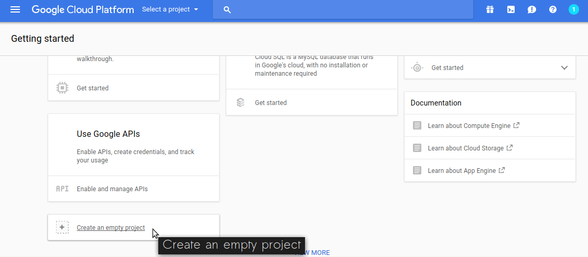
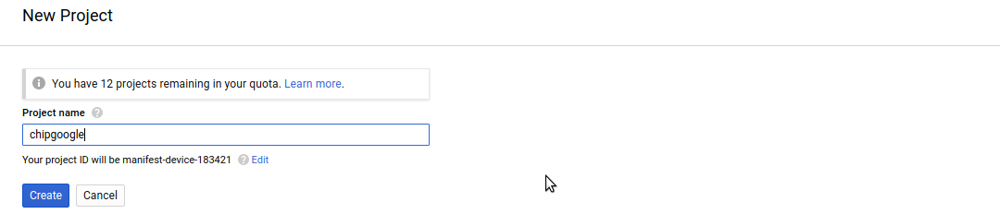
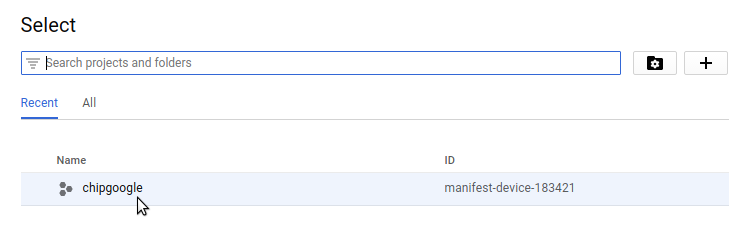
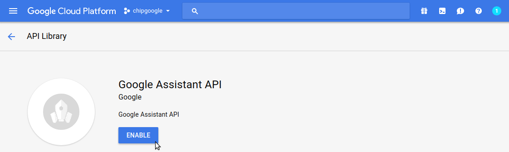
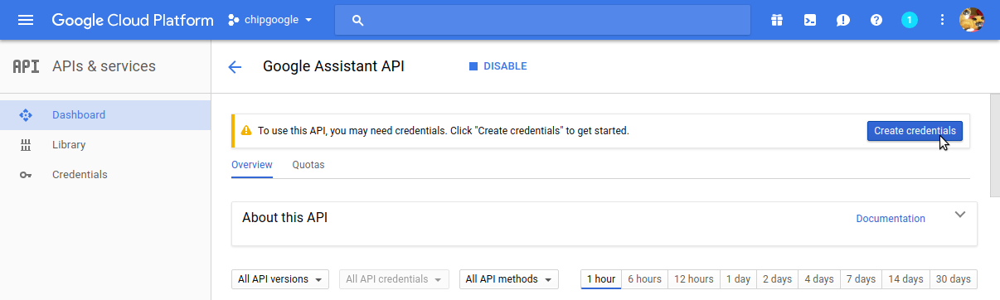
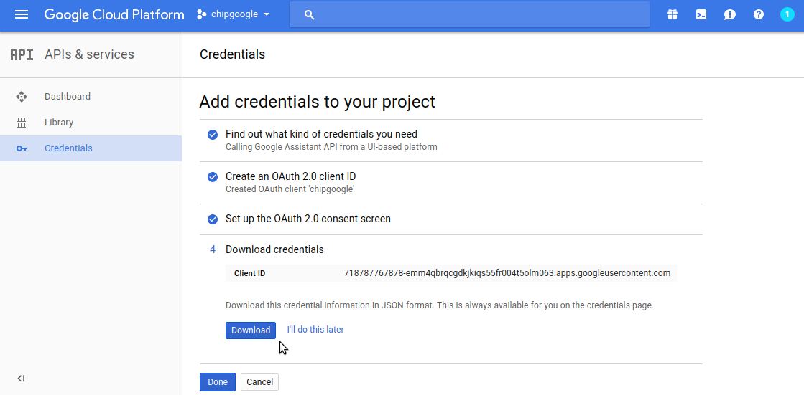
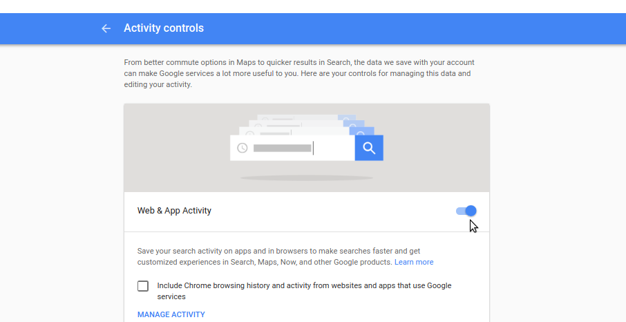

1) Scroll down and click the **Create Empty Project** tile. 

2) Give the project a name, for example **chipgoogle**.

3) From the **Select a project** dropdown menu in the upper left corner choose the new project.

4) Open the Google Assistant **API manager**.

5) Click blue **Enable** button.

6) Click **Create Credentials**.

 
7) In **Step 1** of **Add credentials to your project** and under **Where will you be calling the API from**, select **Other UI (e.g. Windows, CLI tool)**. For **What data will you be accessing"** select the **User data** circle. Now tap **What credentials do I need?**

8)In **Step 2** create an OAuth 2.0 client ID name, for example **chipgoogle**.
!(images/createclientid.png)

9) Under **Step 3** enter **My CHIP Pro Google Assistant** in the field under **Product name shown to users**. Then click **Continue**.

10) Click *Download** in the final 4th step. A JSON file will be downloaded to your development machine. 

11) Go to the [Activity Controls](https://myaccount.google.com/activitycontrols) of your google account and make sure that **Web & App Activity**, **Location History**, **Device Information**, and **Voice & Audio Activity** are enabled. This is so Google Assistant can actually read you personalized information.

12) Upload the client_secret_XXX.json file you downloaded in Step #10 to this page by clicking the **Choose File** button and then **Submit**.
